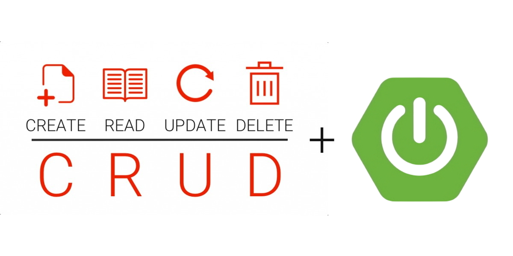
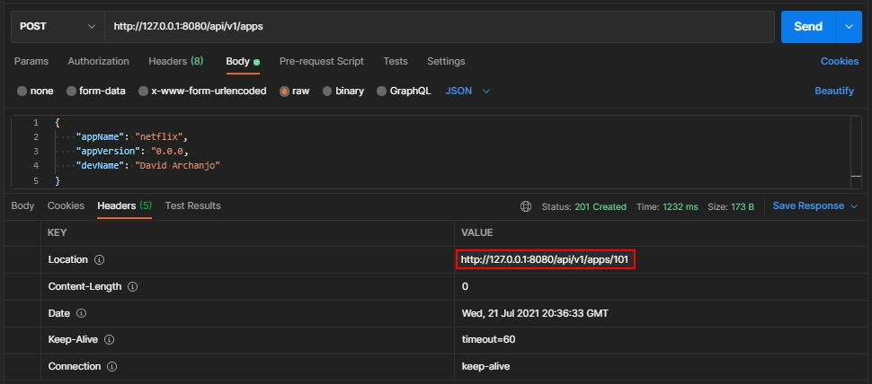
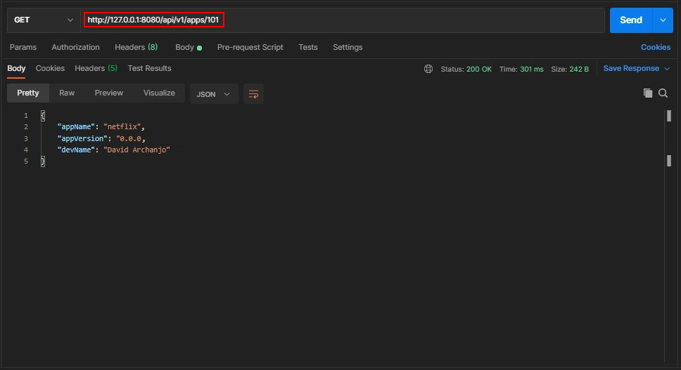
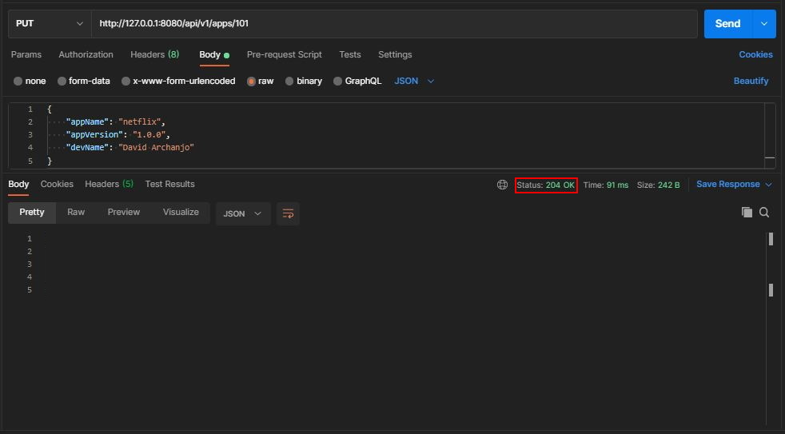
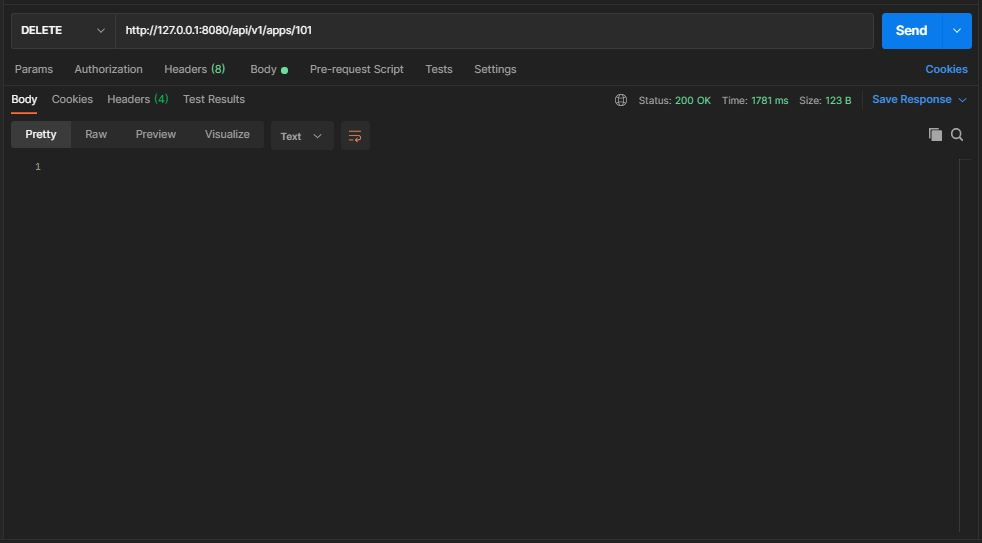
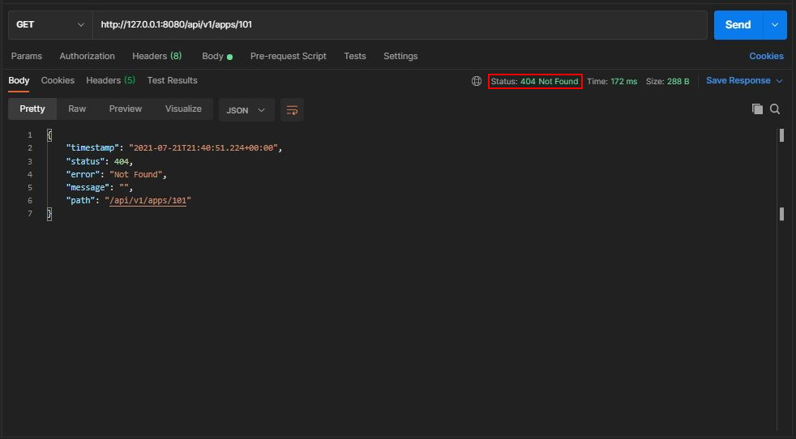

# Spring Boot CRUD Application 


## Introduction

### Spring Boot
[Spring Boot](https://spring.io/projects/spring-boot) is one of the most famous [Spring](https://spring.io/projects/spring-framework) project used nowadays. It came to facilitate the process of configuring and publishing enterprise applications. It helps create stand-alone, production-grade Spring based applications with minimal effort. **Spring Boot** was conceived to be an "opinionated framework" because it follows an opinionated default configuration approach which reduces the developer efforts configuring the application.

Each application built using **Spring Boot** needs merely to define a Java class annotated with `@SpringBootApplication` as its main entry point. This annotation encapsulates the following other annotations:
- `@Configuration` – marks the class as a source of bean definitions.
- `@EnableAutoConfiguration` – indicates to the framework to add beans based on the dependencies on the classpath automatically.
- `@ComponentScan` – scans for other configurations and beans in the same package as the Application class or below.

### CRUD Application
The most common way to start using **Spring Boot** is by implementing a CRUD (a.k.a **C**reate, **R**ead, **U**pdate, **D**elete) application. I particularly consider it a "Hello World" when it comes to microservice frameworks, because most of what it is used for is related to building APIs. ***A CRUD application essentially contains the very basic functionalities that every API could have.***


## Project Structure
When working with **Spring Boot** projects there is no constrained package structure and the actual structure will be driven by your requirement. However for convenience and simplicity's sake, the structure of this sample project is organized, not totally though, by following the MVC (a.k.a. **M**odel **V**iew **C**ontroller) Pattern. You can find more details about this pattern [here](https://examples.javacodegeeks.com/spring-mvc-architecture-overview-example/).

The following are the base folders in which the project is organized and the purpose of each:
- [📁 adapter](./src/main/java/br/com/darchanjo/examples/adapter): contain utility classes responsible for converting entity to DTO (a.k.a. **D**ata **T**ransfer **O**bject) and vice-versa
- [📁 config](./src/main/java/br/com/darchanjo/examples/config): contain definition of beans through Spring configuration classes annotated with `@Configuration`
- [📁 controller](./src/main/java/br/com/darchanjo/examples/controller): contain classes annotated with `@Controller` responsible for processing incoming REST API requests
- [📁 exception](./src/main/java/br/com/darchanjo/examples/exception): contain custom exceptions for handling specific data consistent and/or business rule violations
- [📁 model](./src/main/java/br/com/darchanjo/examples/model): contain POJO classes (a.k.a. **P**lain **O**ld **J**ava **O**bject) annotated with `@Entity` representing database entities i.e., classes mapping database tables
- [📁 repository](./src/main/java/br/com/darchanjo/examples/repository): contain classes annotated with `@Repository` responsible for providing the mechanism for storage, retrieval, search, update and delete operation on objects usually present in a database
- [📁 service](./src/main/java/br/com/darchanjo/examples/service): contain classes annotated with `@Service` in which business logic is implemented
- [📁 web](./src/main/java/br/com/darchanjo/examples/dto): contain DTO classes which are used as objects that pass through architectural boundaries to transfer data


## Prerequisites
- Maven 3+
- Java 8+


## Libraries and Dependencies
- [Spring Web](https://docs.spring.io/spring-framework/docs/current/reference/html/web.html)
- [Spring Data JPA](https://spring.io/projects/spring-data-jpa)
- [JUnit 5](https://junit.org/junit5/)
- [Mockito](https://site.mockito.org/)
- [Hamcrest](http://hamcrest.org/)
- [H2 Database](https://www.h2database.com/html/main.html)
- [Lombok](https://projectlombok.org/)
- [ModelMapper](http://modelmapper.org/)
- [JavaFaker](https://github.com/DiUS/java-faker)


## The Sample Project
This sample project implementes an API to manage applications produced by a fictitious software company. For each application release, its name, version and developer are registered. An H2 in-memory database is being used, but you can easily set up a real database if you like. For instance, to configure a MySQL database you'd only need to do the following two steps:

1. Add MySQL dependency to [pom.xml](./pom.xml)
````xml
<dependency>
    <groupId>mysql</groupId>
    <artifactId>mysql-connector-java</artifactId>
    <scope>runtime</scope>
</dependency>
````

2. Add MySQL connection properties to [application.yml](./src/main/resources/application.yml)
````yaml
spring:
  datasource:
    driverClassName: com.mysql.jdbc.Driver
    url: jdbc:mysql://127.0.0.1:3306/apps_database?useSSL=false
    username: root
    password: root
  jpa:
    properties:
      hibernate:
        dialect: org.hibernate.dialect.MySQL5InnoDBDialect
    hibernate:
      ddl-auto: update
````
**NOTE:** By default, **Spring Boot** configures the application to connect to H2 database with the username `sa` and an empty password when finding H2 connector dependency in the classpath.

## Booting Up the Application
For simplicity's sake, I prefer to use the command line when trying something new but you can google on how to set up a maven project in your favorite IDE.. 😉
<ol>
<li>Clone the repository:</li>
  <code>git clone https://github.com/davidarchanjo/spring-boot-crud-rest</code>
<li>Navigate to the folder:</li>
  <code>cd spring-boot-crud-rest</code>
<li>Run the application:</li>
  <code>mvn spring-boot:run</code>
</ol>


## Testing
1. Create New App
- URL: http://127.0.0.1:8080/api/v1/apps
- HTTP Method: POST
- Body:
  ````json
  {
    "appName": "netflix",
    "appVersion": "0.0.0",
    "devName": "David Archanjo"
  }
  ````
  
  **NOTE:** According to [RFC standard](https://www.w3.org/Protocols/rfc2616/rfc2616-sec10.html), we should return a 201 HTTP status on creating the request resource successfully. In most of the applications the id of the newly created resource is generated, so it is a good practice to return it. To do so, the newly created resource can be referenced by the URI(s) returned in the entity of the response, with the most specific URI for the resource given by a `Location` header field. According to outlined in the screenshot, it returns accordingly at the response header.

2. Get App by ID
- URL: http://127.0.0.1:8080/api/v1/apps/{appId} 
- HTTP Method: GET
  
  **NOTE:** According to outlined in the screenshot, we are using the URI provided in the header from the response of the previous request.

3. Update App
- HTTP Method: PUT
- URL: http://127.0.0.1:8080/api/v1/apps/{appId}
- Body:
  ````json
  {
    "appName": "netflix",
    "appVersion": "1.0.0",
    "devName": "David Archanjo"
  }
  ````
  
  **NOTE:** According to [RFC 2616](http://www.w3.org/Protocols/rfc2616/rfc2616.html) at [Section 9.6](http://www.w3.org/Protocols/rfc2616/rfc2616-sec9.html#sec9.6), for a response with ***no body*** upon a successful PUT request, it should be returned a 204 HTTP status code, according to outlined in the screenshot.
  
4. Delete APP
- HTTP Method: DELETE
- URL: http://127.0.0.1:8080/api/v1/apps/{appId}
  
  
  If we try to look up the deleted application by its id we will get an HTTP 404 status code response:
  


## Unit Test
Unit tests are a must for any business application, regardless of its complexity and size. Therefore, to demonstrate some of the functionality from the combination of **JUnit 5** + **Mockito** + **Hamcrest**, some controller and integration tests were implemented. You can check them by going to the [📁 test](./src/test/java/br/com/darchanjo/examples/) folder. To execute the tests, from the project root, run:
````bash
$ mvn test
````


## That's All Folks
I aimed to pass as much of what I consider to be the most basic in a Spring Boot CRUD application. It is obvious that a lot was left out in order to not detract from the purpose of being a **sample project**.